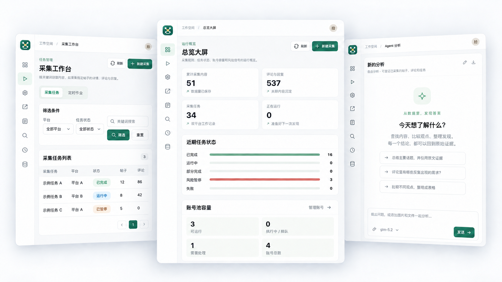
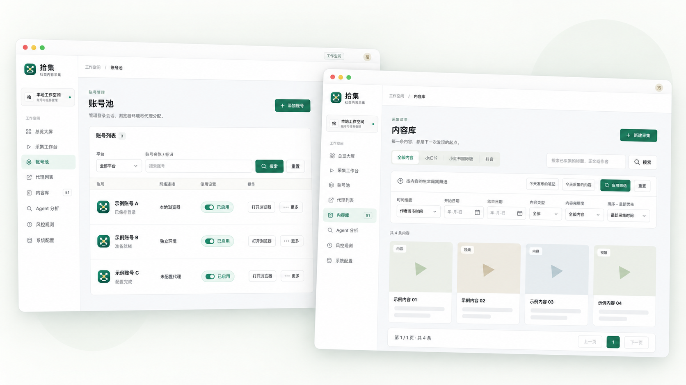

# Social Crawler


一个在本地运行的小红书（XHS / RedNote）和抖音内容采集工具，带 Web 控制台和 CLI。





支持：

- 采集帖子、评论和回复
- 管理账号、浏览器环境和代理
- 定时任务和中断恢复
- 浏览、导出和 Agent 分析

数据保存在 PostgreSQL。在线采集需要你自己的可用账号，建议先用少量数据测试。

## 使用边界

本项目用于技术学习和个人内容管理，不提供账号、Cookie、代理或平台数据。使用时请遵守目标平台规则及所在地法律法规，并尊重内容版权和个人隐私。

请只处理你有权使用的内容，合理控制范围和频率，不要绕过访问控制、干扰平台运行或传播未经授权的数据。平台名称只用于说明兼容性，本项目与相关平台没有隶属、赞助或认可关系。

使用 Agent 分析时，所选资料会发送给你配置的模型服务。项目不自行实现平台签名或风控算法；小红书签名由第三方库 [xhshow](https://pypi.org/project/xhshow/) 提供。

## 快速开始

安装 Python 3.13 和 [uv](https://docs.astral.sh/uv/)，然后运行：

```sh
uv sync --locked
cp -n .env.example .env.local
./scripts/start_local.sh
```

打开 <http://127.0.0.1:8765>。默认数据目录是 `social-crawler-local/`；已有数据库可通过 `CRAWLER_DATABASE_URL` 接入。

### Docker

```sh
cp -n .env.example .env.deploy
docker compose --env-file .env.deploy up --build
```

控制台默认只允许本机访问。项目提供构建文件，但暂不发布预构建镜像。AdsPower 和部署选项见[配置指南](docs/guides/configuration.md)与[运行维护](docs/operations/runtime.md)。

## 文档

- [Web 控制台](docs/guides/web-console.md) · [配置指南](docs/guides/configuration.md) · [Agent 分析](docs/guides/agent-analysis.md)
- [运行维护](docs/operations/runtime.md) · [架构说明](docs/design/architecture.md) · [全部文档](docs/README.md)

参与开发见 [CONTRIBUTING](CONTRIBUTING.md)，安全问题见 [SECURITY](SECURITY.md)，版本记录见 [CHANGELOG](CHANGELOG.md)。

## 许可证

项目原创代码和文档采用 [Apache-2.0](LICENSE)。分发要求见 [NOTICE](NOTICE)，第三方组件见 [THIRD-PARTY-NOTICES.md](THIRD-PARTY-NOTICES.md)。许可证不包含平台数据、访问权或商标权；上面的使用边界也不是额外的许可证限制。

软件按现状提供，不保证平台接口一直可用，也不保证采集结果完整或准确。
