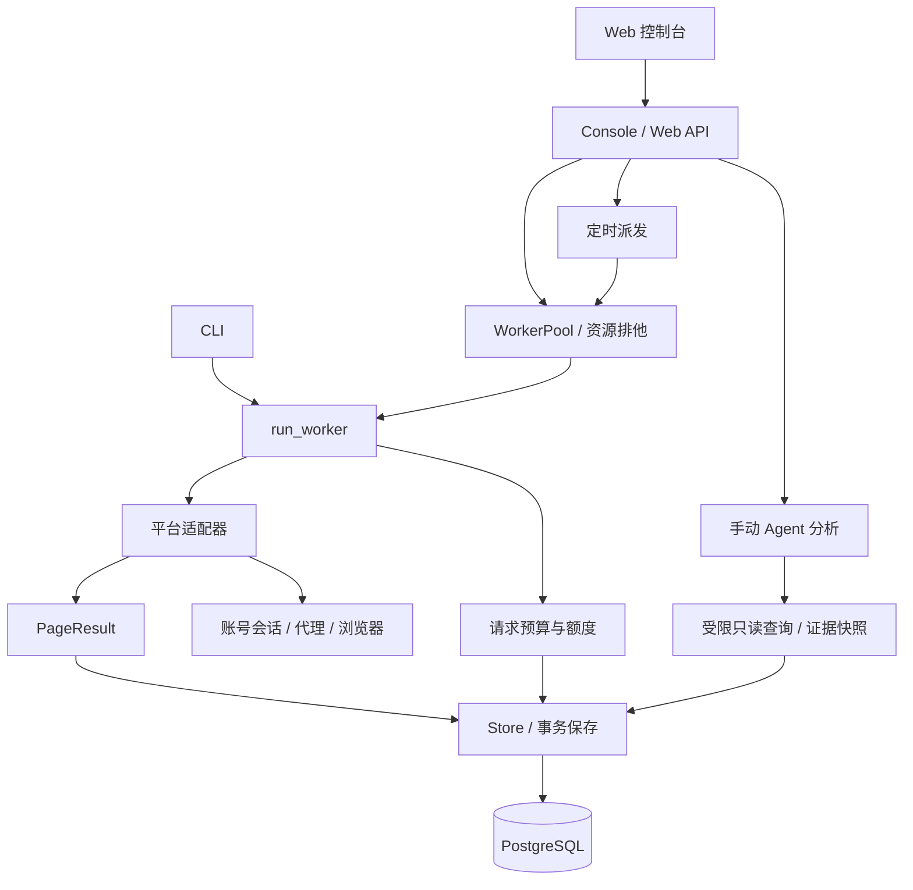

# 架构

Social Crawler 是一个由 Web 控制台和 CLI 驱动的单实例采集服务，数据保存在 PostgreSQL。应用进程内可以运行多个 worker，但账号、浏览器目录及代理等冲突资源必须串行使用。

## 模块划分

| 模块 | 职责 | 主要入口 |
| --- | --- | --- |
| `interfaces` | Web API、静态控制台、CLI、浏览器查看网关 | [web.py](../../src/social_crawler/interfaces/web.py)、[cli.py](../../src/social_crawler/interfaces/cli.py) |
| `domain` | 任务配置、统一操作与结果、错误分类、目标解析、脱敏及时间标准化 | [models.py](../../src/social_crawler/domain/models.py) |
| `orchestration` | 定时派发、进程内 worker 池、请求预算、执行循环、媒体下载、报告导出 | [worker.py](../../src/social_crawler/orchestration/worker.py) |
| `adapters` | 将平台页面或 HTTP 响应转成统一分页结果 | [xhs](../../src/social_crawler/adapters/xhs/)、[douyin](../../src/social_crawler/adapters/douyin/) |
| `environments` | Cookie、代理、浏览器运行时、环境快照、登录和会话恢复 | [session.py](../../src/social_crawler/environments/session.py) |
| `storage` | SQLAlchemy 表定义、事务、去重、账号池、额度与 Alembic 迁移 | [store.py](../../src/social_crawler/storage/store.py) |
| `analysis` | 用户触发的只读 Agent 分析、会话、附件和证据保存 | [service.py](../../src/social_crawler/analysis/service.py) |

## 采集方式

| 平台 | 默认路径 | 可选路径 | 输入与输出 |
| --- | --- | --- | --- |
| 小红书 `xhs` | 浏览器页面操作 | `httpx`、`curl_cffi` | 关键词或指定帖子；详情、一级评论、有界回复 |
| RedNote `rednote` | 浏览器页面操作 | `httpx`、`curl_cffi` | 与 XHS 共用适配器结构，站点与账号环境分离 |
| 抖音 `douyin` | HTTP 取数与浏览器签名环境 | 无传输选择字段 | 关键词或指定帖子；详情、一级评论、有界回复 |

XHS 与 RedNote 的域名、Cookie 域和媒体域由 [sites.py](../../src/social_crawler/adapters/xhs/sites.py) 集中定义。数据库按平台区分记录，两个站点的同名 ID 和登录资料相互独立。浏览器 provider 为 Chromium、AdsPower 或 Kameleo；两个托管 provider 当前用于 XHS / RedNote，Kameleo 首版只支持本机桌面 Chrome profile。

`RunConfig` 接受 `keyword`、`posts` 两种来源。首次部署后，需要使用已配置的账号进行小范围在线验证。

## 一次采集的主路径

1. Web 或 CLI 校验任务范围，读取账号与网络配置；Web 可以从对应平台账号池选择账号，手动指定账号时不回退到其他账号。
2. 创建运行与初始任务。关键词来源先搜索，指定帖子来源先解析目标；结果逐步派生详情、评论与回复任务。
3. Worker 等待账号和浏览器资源空闲，检查登录、网络及请求额度。
4. 适配器返回 `PageResult`，Store 将数据、后续任务和分页进度一起写入数据库。
5. 达到范围、平台明确结束、预算耗尽、取消或发生错误时，保存状态与停止原因。Web 展示结果，CLI 输出报告。

详情成功后可选下载媒体到本地 artifacts 目录，默认关闭。媒体下载结果单独记录；下载失败不把已取得的正文判为失败。采集结束不自动调用分析模型。

## 部署与持久化

本地脚本启动应用与隔离 PostgreSQL，或连接指定数据库。Compose 提供 PostgreSQL 和应用容器。Kubernetes 基础示例使用一个应用副本，AdsPower 通过可选 sidecar 与应用共享 loopback、X11 socket 和共享内存。

数据库之外还要持久化 Cookie、浏览器 profiles、分析恢复记录、附件和媒体。只备份数据库不足以恢复登录和连续分析会话。详见 [运行维护](../operations/runtime.md)。

应用通过进程锁和本机文件锁避免账号、浏览器资源冲突，目前不支持跨节点协调，因此只部署一个实例。需要提高并发时调整 `CRAWLER_WORKERS`，并使用不同账号。

进一步阅读：[任务与存储](execution-and-storage.md)、[账号与浏览器](accounts-and-browsers.md)、[分析模块](analysis.md)。
